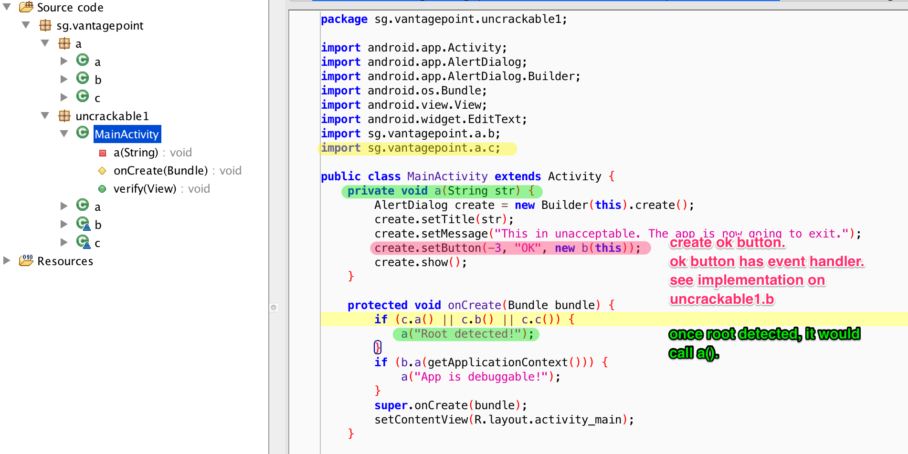
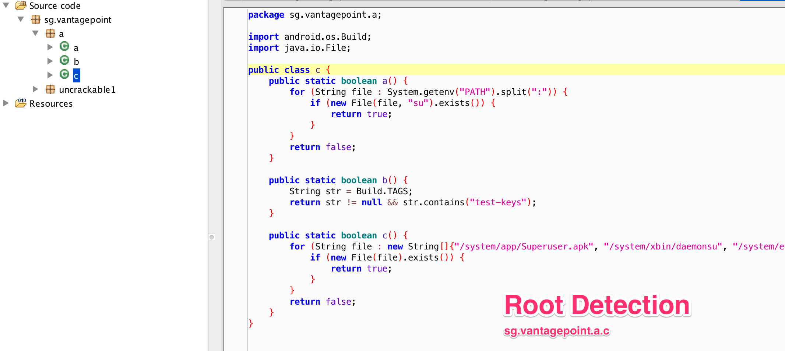
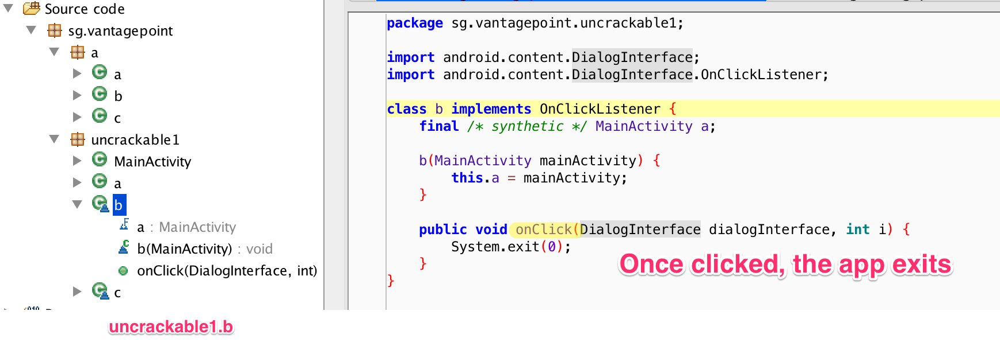
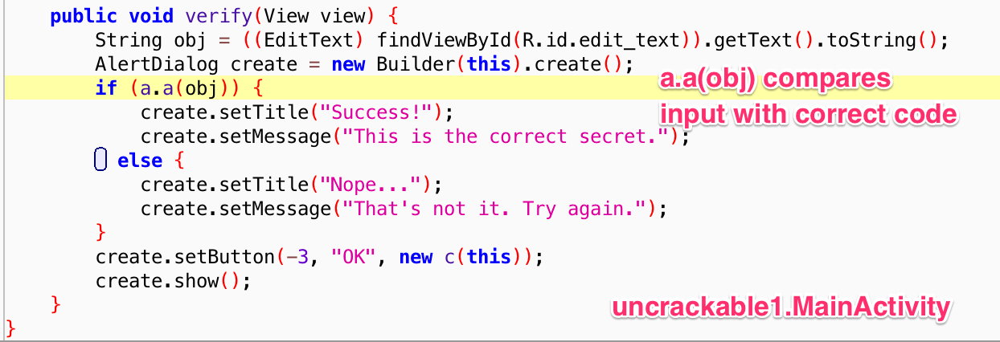
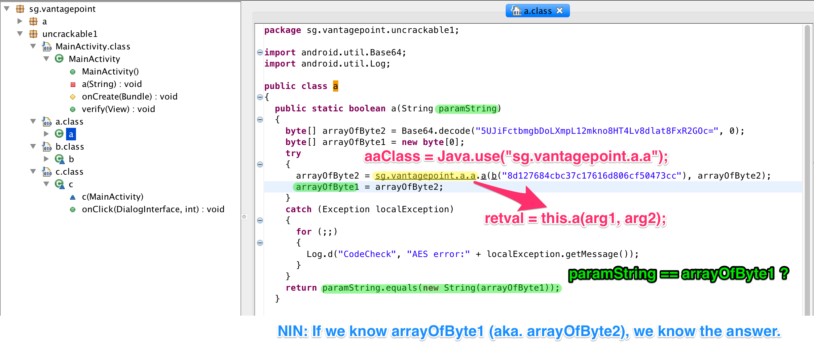

## APK

Download [here](https://github.com/OWASP/owasp-mstg/tree/master/OMTG-Files/02_Crackmes/01_Android/Level_01)

## Ref

- [Hacking Android apps with FRIDA I](https://www.codemetrix.net/hacking-android-apps-with-frida-1/)
- [Hacking Android apps with FRIDA II](https://www.codemetrix.net/hacking-android-apps-with-frida-2/)


Hacking Android apps with FRIDA ([I](https://www.codemetrix.net/hacking-android-apps-with-frida-1/), [II](https://www.codemetrix.net/hacking-android-apps-with-frida-2/)). Post分为两 Part. 第一 Part 是笔者找到的对于 frida 基本功能介绍得最深刻的文章. 第二 Part 介绍了 Root Detection Bypass, 和 hook the password.

1. 由于是 android app 的关系, 入手的第一步都是先反编译, 获取 source code, 找寻有价值的代码.
2. Class - `sg.vantagepoint.a.c`中b()的 implementation 正是root Detection的代码.
3. 利用[JAVA API](https://www.frida.re/docs/javascript-api/#java) 改写onClick implementation, 逃避root Detection
4. 获得Decryption的代码, 尽管已被 obfuscated, 但是我们并不需要研究它是如何实行, 只需要利用 frida hook `sg.vantagepoint.a.a.a` function, catch its return value.


----

## Source Code

App 有三个 sub function 去 check 是否 root 了. 一旦检测到root, 就会 call `a('Root detected.')`. `a('Root detected.')`会生成一个 dialogue box, 具体实现就看`uncrackable1.b`.



可以看到`b.onClick()`要做得就是 exit app.



## Bypass Root Detection

我们可以将三个 root detection 的 sub function 都用frida 修改其 implementation, 使其返回 true. 我们也可以直接修改`uncrackable1.b.onClick()`, 让其不要退出 app. 明显后者, 更简单.

```javascript
setImmediate(function() { //prevent timeout
    console.log("[*] Starting script");

    Java.perform(function() {

      bClass = Java.use("sg.vantagepoint.uncrackable1.b");
      bClass.onClick.implementation = function(v) {
         console.log("[*] onClick called");
      }
      console.log("[*] onClick handler modified")

    })
})

```

## Decrypt Password

可以看到`a.a(obj)`校验 input, 假如正确就返回 success. 


下面我们看看`a.a(obj)`的实际 implementation.


假如我们知道arrayOfByte1或者 arrayOfByte2, 我们就知道 flag.

利用 frida 修改 `sg.vantagepoint.a.a.a`的 implementation.

```javascript
	aaClass = Java.use("sg.vantagepoint.a.a");
    aaClass.a.implementation = function(arg1, arg2) {
        retval = this.a(arg1, arg2);
        password = ''
        for(i = 0; i < retval.length; i++) {
           password += String.fromCharCode(retval[i]);
        }

        console.log("[*] Decrypted: " + password);
        return retval;
    }
```

```bash
$ frida -U -l exploit1.js sg.vantagepoint.uncrackable1
```


