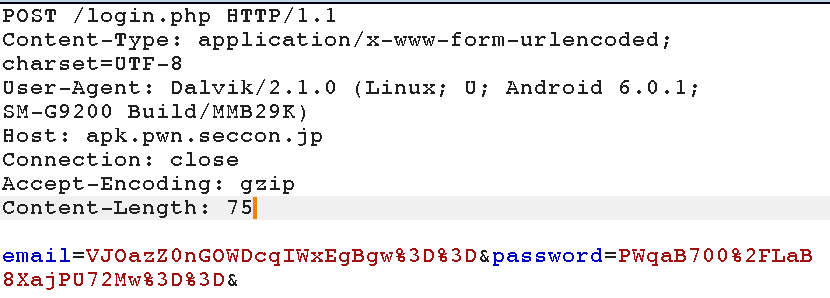
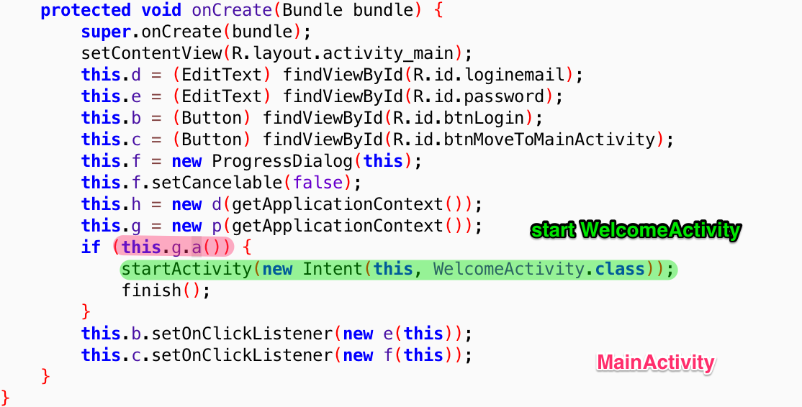
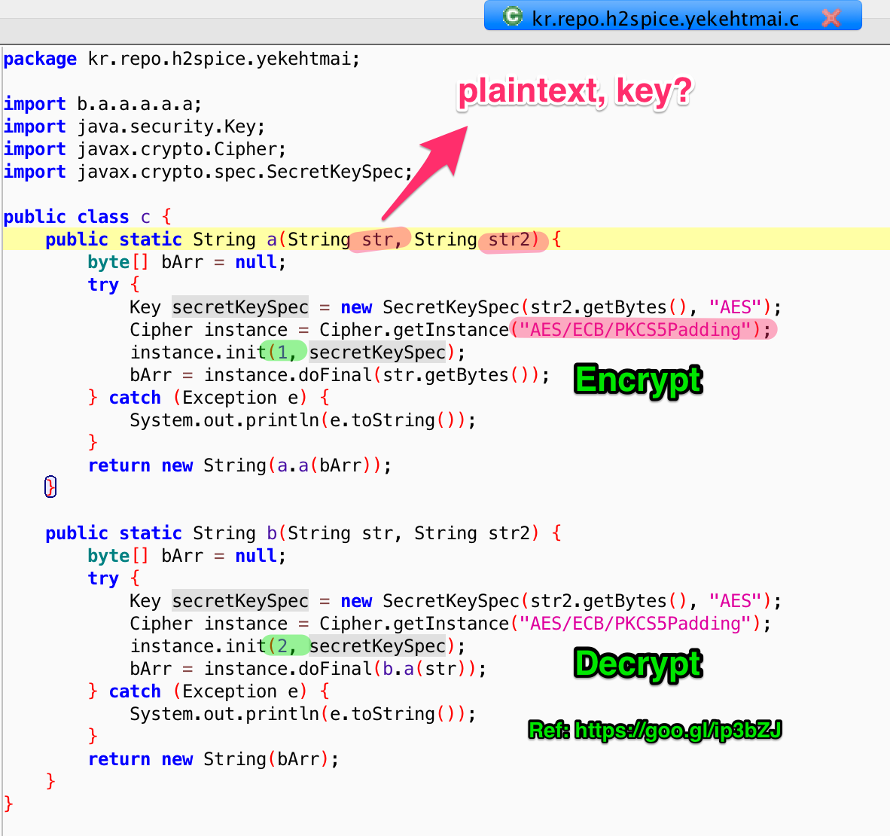

# 6. Get Encryption Key

## APK

[Github](https://github.com/ctfs/write-ups-2015/blob/master/seccon-quals-ctf-2015/unknown/reverse-engineering-android-apk-2/app-release-apk.pwn.seccon.jp-v1.3.apk)

## Ref

https://cedricvb.be/post/seccon-2015-reverse-engineering-android-apk-2-400-writeup/

----

## Burp



## Source code

The app is obfuscated using simple name mangling.




假如未 Login, 就显示两个 input field, 否则 start WelcomeActivity.

```java

	// kr.repo.h2spice.yekehtmai.p
	// this.g.a() -> this.p.a()

    public boolean a() {
        return this.a.getBoolean("isLoggedIn", false);
    }
```

The AES key is not statically stored in the application but is obfuscated using a ton of other “encoding/encryption” routines.



## Solution

Use dynamic instrumentation.

```bash
frida -U kr.repo.h2spice.yekehtmai
```


```javascript
Java.perform(function () {
    var c = Java.use("kr.repo.h2spice.yekehtmai.c")
    c.a.implementation = function (str1, str2) {
        console.log("String1: " + str1)
        console.log("String2: " + str2)
    }
});
```


## Alternative Solution

1. attach a debugger, inject some smali code.

It would involve decompiling the APK to smali with APKtool, then repackaging the APK with debug information, and running the app via an IDE in debug mode. Injecting smali code would also require me to repackage the APK. 

Ref: [Home of the gn00bz](http://gnoobz.com/seccon-online-ctf-2015-reverse-engineering-android-apk-2.html)

## Ref
- [Home of the gn00bz](http://gnoobz.com/seccon-online-ctf-2015-reverse-engineering-android-apk-2.html)
- [SECCON CTF 2015 - APK2 · blukat29](https://blukat29.github.io/2015/12/seccon-ctf-2015-apk2/)
- [SECCON 2015 – Reverse engineering Android APK 2 – 400 writeup – Cedric's Cruft](https://cedricvb.be/post/seccon-2015-reverse-engineering-android-apk-2-400-writeup/)
