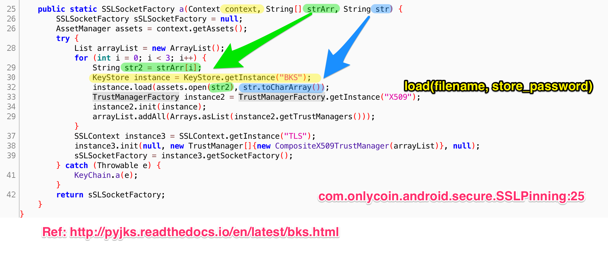
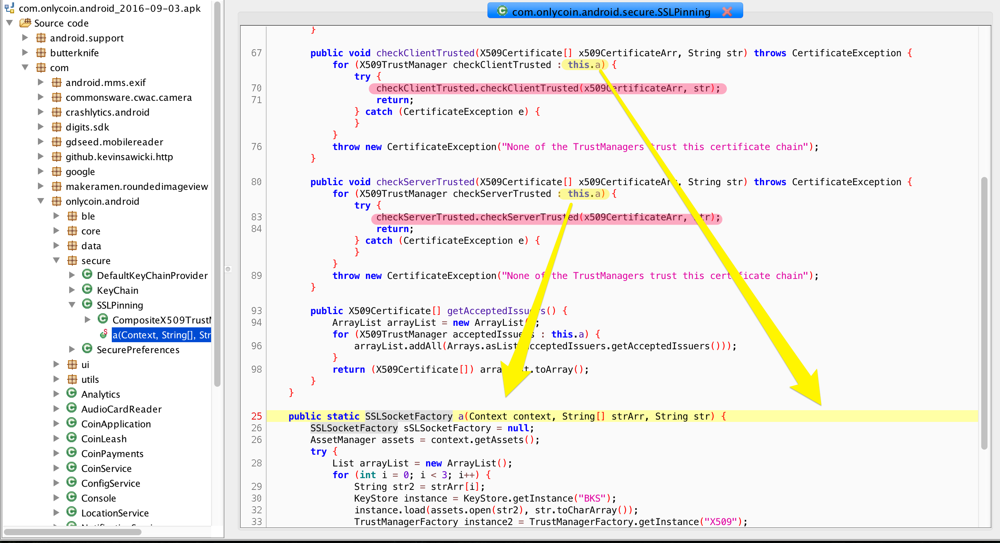

## APK
Download from GooglePlay

## Ref

http://rotlogix.com/2015/09/13/defeating-ssl-pinning-in-coin-for-android/

----

## Source Code

利用 JadxGUI 查看 APK的 code. 发现关于 SSLPinning的 code在`com.onlycoin.android.secure.SSLPinning`.

Pinning的 certificate 存在于Bouncy Castle key store 中.


> BKS is a keystore format provided by the popular third party Java cryptographic library provider -- BouncyCastle. It is a keystore similar to the JKS provided by Oracle JDK. 

App 会先把 BKS 中的 certificate 全部 load出来 (`this.a()`),然后再调用`CompositeX509TrustManager` class 的`checkClientTrusted` 和 `checkServerTrusted`判断现时使用的 certificate是否包含其中.





将SSLPinning的function - `a(Context context, String[] strArr, String str)`中所需的三个参数 print 出来, 由此我们可以获得 bks, 以及其 password.

## Exploit


```bash
➜  ssl_pinning_bypass python exploit.py
[*] SSLPinning
[*] com.onlycoin.android.CoinApplication@40e5333
[*] coincert.bks,coincert_new.bks,coincert_amz.bks
[*] laggardness287{satisfactoriness
{u'columnNumber': 1, u'description': u"Error: Implementation for a expected return value compatible with 'javax.net.ssl.SSLSocketFactory'.", u'fileName': u'input', u'lineNumber': 1, u'type': u'error', u'stack': u"Error: Implementation for a expected return value compatible with 'javax.net.ssl.SSLSocketFactory'.\n    at a (input:1)"}
'payload'
```


## Post-Exploit

将 APK 解压, 搜索得知 bks文件存在于`apk_unzip/assets`. 

```bash
➜  ssl_pinning_bypass find . -name *.bks
./apk_unzip/assets/coincert.bks
./apk_unzip/assets/coincert_amz.bks
./apk_unzip/assets/coincert_new.bks
```

查看 bks 里面包含什么.

> `bcprov-jdk15on-156.jar`, 下载地址: https://www.bouncycastle.org/latest_releases.html
>
> Ref: https://goo.gl/eWhzTS

```bash
➜  ssl_pinning_bypass keytool -list -v -keystore ./apk_unzip/assets/coincert.bks -provider org.bouncycastle.jce.provider.BouncyCastleProvider -providerpath "bcprov-jdk15on-156.jar" -storetype BKS -storepass "laggardness287{satisfactoriness"

Keystore type: BKS
Keystore provider: BC

Your keystore contains 1 entry

Alias name: ca
Creation date: Apr 15, 2016
Entry type: trustedCertEntry

Owner: C=US,PostalCode=94107,ST=CA,L=San Francisco,STREET=185 Berry St\, Suite 1510,O=Coin Inc,OU=PremiumSSL Wildcard,CN=*.coin.vc
Issuer: C=GB,ST=Greater Manchester,L=Salford,O=COMODO CA Limited,CN=COMODO RSA Organization Validation Secure Server CA
Serial number: 118778e14b7c10d64dca229ea0bbbf3d
Valid from: Wed Mar 11 08:00:00 CST 2015 until: Mon May 09 07:59:59 CST 2016
Certificate fingerprints:
   MD5:  C3:D3:BF:18:AA:9C:B6:87:7A:54:EE:F1:B9:CD:F2:E1
   SHA1: C0:4D:2C:4A:64:4D:45:DF:CB:22:76:24:56:23:86:95:A3:AF:7E:44
   SHA256: 48:EB:AE:3E:FA:DA:5A:01:D8:4F:5E:FD:2B:D5:81:F8:CA:A4:AD:0F:52:01:50:5E:5F:17:E4:5B:56:E9:99:37
   Signature algorithm name: SHA256WITHRSA
   Version: 3


*******************************************
*******************************************
```

我们要做的就是将 Burp 的 certificate加入其中.

> Ref: https://goo.gl/ieS2xY
>
> `keytool -importcert -v -trustcacerts -file "my_certificate_pathmy_certificate.cer" -alias myAlias -keystore "my_keystore_path/mykeystore.bks" -provider org.bouncycastle.jce.provider.BouncyCastleProvider -providerpath "provider_path/bcprov-jdkxx-xxx.jar" -storetype BKS -storepass "my_password"`

```bash
$ keytool -importcert -v -trustcacerts -file /path/to/burp.cer -providerpath /path/to/bcprov-jdk15on-156.jar -provider org.bouncycastle.jce.provider.BouncyCastleProvider -storetype BKS -keystore /path/to/coincert.bks
```

然后再 repack App, 重新安装即可.


